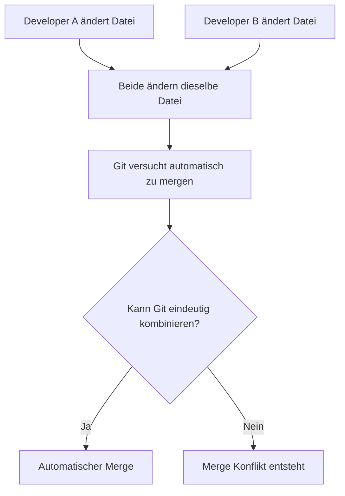
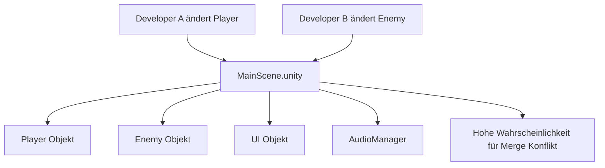
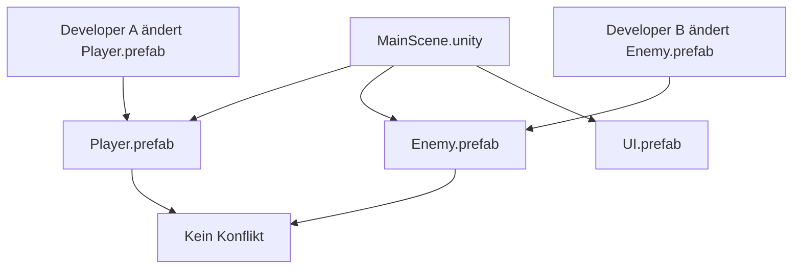
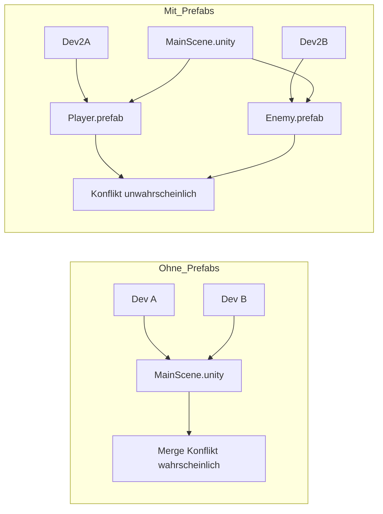

# Merge-Konflikte in Unity und die Rolle von Prefabs

## 1. Wie entstehen Merge-Konflikte?

Git arbeitet textbasiert. Ein Merge-Konflikt entsteht, wenn:

1. Zwei Entwickler dieselbe Datei verändern.
2. Git die Änderungen nicht eindeutig automatisch zusammenführen kann.
3. Änderungen im selben oder überlappenden Bereich liegen.

Unity speichert Szenen (`.unity`) und Prefabs (`.prefab`) als YAML-Textdateien.  
Große Dateien mit vielen Objekten erhöhen die Wahrscheinlichkeit für Konflikte.

---

## 2. Problem: Arbeiten ohne Prefabs

Wenn alle Objekte direkt in einer Szene gespeichert werden, arbeiten alle Entwickler an derselben Datei.

Beispiel:
- Entwickler A ändert den Player
- Entwickler B ändert den Enemy
- Beide verändern `MainScene.unity`

Obwohl unterschiedliche Objekte verändert werden, ist die betroffene Datei identisch.  
Dadurch steigt die Wahrscheinlichkeit für einen Merge-Konflikt erheblich.

---

## 3. Lösung: Modularisierung mit Prefabs

Prefabs teilen das Projekt in mehrere Dateien auf.

Statt alle Objekte in einer Szene zu speichern, werden sie als eigenständige `.prefab`-Dateien verwaltet.

Jetzt arbeiten Entwickler an unterschiedlichen Dateien.  
Da Git dateibasiert arbeitet, entstehen keine Konflikte, solange verschiedene Dateien geändert werden.

---

## 4. Vergleich: Ohne vs. Mit Prefabs

---

## 5. Technischer Hintergrund

Unity speichert Objekte mit internen IDs, Referenzen und serialisierten Feldern im YAML-Format.  
Kleine Änderungen können große Textunterschiede erzeugen.

Je größer die Datei:
- desto mehr Objekte sind betroffen
- desto höher die Wahrscheinlichkeit für Überschneidungen
- desto schwieriger wird das automatische Zusammenführen

Durch die Aufteilung in mehrere Prefab-Dateien werden Änderungen isoliert gespeichert und Konflikte reduziert.

---

## Fazit

Merge-Konflikte in Unity entstehen hauptsächlich durch das gleichzeitige Bearbeiten großer Szenen-Dateien.

Prefabs sind relevant, weil sie:

- das Projekt modularisieren
- Änderungen auf mehrere Dateien verteilen
- paralleles Arbeiten ermöglichen
- die Konfliktwahrscheinlichkeit deutlich reduzieren

Eine saubere Prefab-Architektur ist daher essenziell für professionelle Teamarbeit mit Unity und Git.
